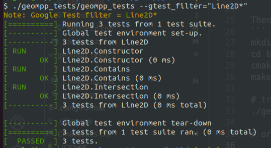

# Geom++ 

[](https://github.com/amastrobera/geompp/actions/workflows/build_test_windows.yml)

[](https://github.com/amastrobera/geompp/actions/workflows/build_test_linux.yml)


### Geometry library for 2D and 3D calculations

The library offers a set of primitive classes to store geometrical data (Point, Ray, LineSegment, Polygon, ... etc). It also contains functionalities for those primities to interact with each other (+/-/*, Intersection, Overlap, ... etc). 

The aim of the library is to be fast, mathematically-correct, well-tested, easy to use and helpful in a variety of languages other than C++, such as Python or C#. 

It is based on C++20 standard.

This geometry library was born to improve the previous [GeomSharp](https://github.com/amastrobera/geom_sharp) libraray, by creating 
(1) better algorithsm, 
(2) faster execution, 
(3) not being limited to C# and .Net Framework. 


### Build it 

#### Linux
On linux, I have used the `g++13`, you can get it with 
```
sudo add-apt-repository -y ppa:ubuntu-toolchain-r/test
sudo apt install -y g++-13

# remove and recreate symbolic links
sudo rm -f /usr/bin/g++
sudo rm -f /usr/bin/c++
sudo ln -s /usr/bin/g++-13 /usr/bin/g++
sudo ln -s /usr/bin/c++-13 /usr/bin/c++
```

Then simply build it with cmake
```
mkdir buid
cd build
cmake ..
make -j6

# try run test
./geompp_tests/geompp_tests

# or a specific class / test
./geompp_tests/geompp_tests --gtest_filter="Point2D*"
./geompp_tests/geompp_tests --gtest_filter="Point2D.ToFile"
```

You should see something like this 


#### Windows
I have Windows 11, and use Visual Studio 2022. 

Once you install [VS 2022](https://visualstudio.microsoft.com/downloads/), launch the Visual Studio Installer, click on "Modify" and install the _Desktop Development with C++_. 

Open Visual Studio, then _Open Folder_ and select the `geompp`. 

Use Ctrl+Shift+B to build the whole solution, and click on the "Play button" or F5 to run all tests.

You should see something like this 


### Work in Progress ...
#### Done
- build on linux
- build on windows
- set up a lib folder and a test folder
- Point2D, Vector2D, Line2D, Shape2D for return type of geometrical operations, tests
- Line2D::contains(p), Line2D::intersects(line), Line2D::intersection(line), tests
- Ray2D, Ray2D::contains(p), Ray2D::intersection(line), Ray2D::intersection(ray), tests
- LineSegment2D, LineSegment2D::contains(p), LineSegment2D:intersection(line), LineSegment2D:intersection(ray), LineSegment2D:intersection(line_seg), tests

--- test and build infrastructure ---
- github actions: run tests on merge 
- ::FromWkt(str)->Shape2D, ::ToWkt()->str parsing and serializing 
- ::FromFile(wkb)->Shape2D, ::ToFile()->wkb parsing and serializing 

#### Next
--- test and build infrastructure ---
- test cases in `.wkt` files
- On Visual Studio, use the test runner to run specific tests
- Build on windows via command line (install cmake and g++ on windows, use PowerShell)

#### Backlog to do

--- carry on 2D geometry ---
- Line2D::distance(p), Ray2D::distance(p), LineSegment2D::distance(p), tests
- LineSegment2D::interpolate(%)->p, LineSegment2D::location(p)->%, tests
- Polyline2D, Polyline2D::contains(p), Polyline2D::distance(p), tests
- Polyline2D::interpolate(%)->p, Polyline2D::locartion(p)->%, tests
- Polyline2D::intersects(line, ray, line_seg, polyline), tests
- Triangle2D, Triangle2D::contains(p), tests
- Triangle2D::intersects(line, ray, line_seg), tests
- Polygon2D, Polygon2D::contains(p), tests
- Polygon2D::intersects(line, ray, line_seg, triangle, polygon), tests
- List<Point2D>::convex_hull()->polygon, tests

--- more build infrastructure ---
- python bindings 
- write interface for python
- write some sample code
- write some python tests

--- add some 3D classes ----
- Point3D, Vector3D, Line3D, Shape3D for return type of geometrical operations, tests
- Line3D::contains(p), Line3D::intersects(line), Line3D::intersection(line), tests
- Ray3D, Ray3D::contains(p), Ray3D::intersection(line, ray), tests
- LineSegment3D, LineSegment3D::contains(p), LineSegment3D:intersection(line, ray, line_seg), tests
- Line3D::distance(p), Ray3D::distance(p), LineSegment3D::distance(p), tests
- LineSegment3D::interpolate(%)->p, LineSegment3D::location(p)->%, tests
- Polyline3D, Polyline3D::contains(p), Polyline3D::distance(p), tests
- Polyline3D::interpolate(%)->p, Polyline3D::locartion(p)->%, tests
- Polyline3D::intersects(line, ray, line_seg, polyline), tests
- Plane, signed_distance, distance, project_onto, project_into, tests
- Triangle3D, Triangle3D::contains(p), tests
- Triangle3D::intersects(line, ray, line_seg, triangle), tests
- Polygon3D, Polygon3D::contains(p), tests
- Polygon3D::intersects(line, ray, line_seg, triangle, polygon), tests
- List<Point3D>::convex_hull()->polygon, tests

--- more build infrastructure ---
- C#interface for python
- write some sample code
- write some c# tests

--- add overlaps/adjacent (bool) ---
- Line2D::overlaps(line), Line2D::overlap(line), tests
- Ray2D::overlaps(line, ray), tests
- LineSegment2D::overlaps(line, ray, line_seg), tests
- Polyline2D::overlaps(line, ray, line_seg, polyline), tests
- Triangle2D::overlaps(line, ray, line_seg, polyline, triangle), tests (overlap for triangle is "adjacency")
- Polygon2D::overlaps(line, ray, line_seg, polyline, triangle, polygon), tests (overlap for polygon is "adjacency")
- Triangle2D::adjacent(line, ray, line_seg, polyline, triangle), tests (same as overlap)
- Polygon2D::adjacent(line, ray, line_seg, polyline, triangle, polygon), tests (same as overlap)

- Line3D::overlaps(line), Line3D::overlap(line), tests
- Ray3D::overlaps(line, ray), tests
- LineSegment3D::overlaps(line, ray, line_seg), tests
- Polyline3D::overlaps(line, ray, line_seg, polyline), tests
- Triangle3D::overlaps(line, ray, line_seg, polyline, triangle), tests (overlap for triangle is "coplanar, intersecting in 2D")
- Polygon3D::overlaps(line, ray, line_seg, polyline, triangle, polygon), tests (overlap for polygon is "coplanar, intersecting in 2D")
- Triangle3D::adjacent(line, ray, line_seg, polyline, triangle), tests (one side in common, no intersection)
- Polygon3D::adjacent(line, ray, line_seg, polyline, triangle, polygon), tests (one or more sides in common, no intersection)

--- add 2D meshing ---
- Mesh2D class (set of triangles), tests
- Polygon2D::triangulate()->mesh, tests
- Mesh2D::polygonize()->polygon, tests

--- add 3D meshing ---
- Mesh3D class (set of triangles), tests
- Polygon3D::triangulate()->mesh, tests
- Mesh3D::polygonize()->polygon, tests

--- add polygon clipping ---
- Triangle2D::intersection(triangle), test
- Polygon2D::intersection(triangle, polygon), test
- Triangle3D::intersection(triangle), test
- Polygon3D::intersection(triangle, polygon), test
- Triangle3D::overlap(triangle), test
- Polygon3D::overlap(triangle, polygon), test