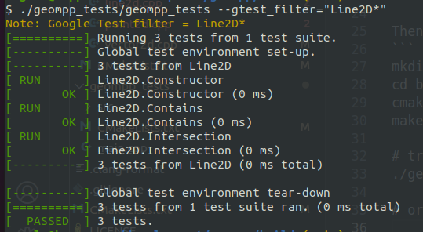

  # Geom++

[](https://github.com/amastrobera/geompp/actions/workflows/build_test_windows.yml)
[](https://github.com/amastrobera/geompp/actions/workflows/build_test_linux.yml)
[](https://github.com/amastrobera/geompp/tags)

[](https://github.com/amastrobera/geompp/actions/workflows/nuget-publish.yml)
[](https://www.nuget.org/packages/GeomPP)

[](https://github.com/amastrobera/geompp/actions/workflows/pypi-publish.yml)
[](https://pypi.org/project/geompp)

  A modern C++20 geometry library for 2D and 3D spatial computation — fast, mathematically correct,
  thoroughly tested, and usable from C++, C# (.Net 10 or .Net Framework 4.8), and Python 3.

  This library is a spiritual successor to [GeomSharp](https://github.com/amastrobera/geom_sharp),
  rewritten to produce better algorithms, faster execution, and no dependency on C#/.NET.

  **Language bindings:**
  [](./geompp_python/README.md) 
  [](./geompp_csharp/README.md) 

  
  

  ## What it provides

  ### Primitives

  Both 2D and 3D variants are available for all core types:

  | Primitive      | Description                                              |
  |----------------|----------------------------------------------------------|
  | `Point`        | A coordinate in space                                    |
  | `Vector`       | Direction and magnitude                                  |
  | `Line`         | An infinite line through two points                      |
  | `Ray`          | A semi-infinite line from an origin in one direction     |
  | `LineSegment`  | A finite segment between two endpoints                   |
  | `Polyline`     | A connected chain of segments                            |
  | `Triangle`     | Three non-collinear points forming a closed face         |
  | `Polygon`      | A closed polygon defined by an ordered list of vertices  |
  | `BBox`         | Axis-aligned bounding box                                |
  | `Plane`        | A flat surface in 3D defined by a point and a normal     |

  ### Operations

  Each primitive supports a consistent set of spatial operations where applicable:

  - **Containment** — does a shape contain a given point?
  - **Intersection** — do two shapes intersect, and what is the resulting geometry?
  - **Distance** — closest distance from a point to a shape
  - **Projection** — project a point onto a line, segment, or plane
  - **Interpolation** — retrieve a point at parameter `t` along a segment or polyline
  - **Location** — find the parameter `t` for a point already on a shape
  - **Area / Perimeter / Centroid** — geometric properties for closed shapes
  - **Signed area** — encodes orientation (clockwise vs. counter-clockwise in 2D, surface normal
  direction in 3D)
  - **Simplicity / self-intersection** — `Polygon2D::IsSimple()` and the free functions `has_intersections(segments)` (Shamos–Hoey, boolean) / `find_intersections(segments)` (Bentley–Ottmann, returns every crossing point)
  - **Convex hull** — `convex_hull(points)` (`point2d.hpp`) — Andrew's monotone chain, returns hull vertices in CCW order

  Return types are `std::optional<std::variant<...>>` so callers can match on the exact geometry
  produced by an intersection without casting.

  ### Serialization

  All primitives support:
  - **WKT** (Well-Known Text) — `ToWkt()` / `FromWkt()` for standard text interchange
  - **Binary file I/O** — `ToFile()` / `FromFile()` for compact storage

  ### Precision

  Floating-point comparisons use a thread-local `DECIMAL_PRECISION` constant via `AlmostEquals()`
  methods, making the library robust against rounding errors while remaining configurable per thread.


  ### How to use it

  Here is an example of code. You can also look at the [test directory](./geompp_tests/) or [sample code](./geompp_sample/sample.cpp) to see more.

  #### Create geometries programmatically
  ```cpp
  // This will be the precision used by all functions, in all threads, for this
  // run of the program, and it can be modified in later code anytime.
  g::DECIMAL_PRECISION = g::DP_THREE;

  // two line segments intersecting at (0,0,1)
  auto s1 = g::LineSegment3D::Make(g::Point3D(1, 0, 0), g::Point3D(-1, 0, 2));
  auto s2 = g::LineSegment3D::Make(g::Point3D(0, 1, 0), g::Point3D(0, -1, 2));

  GEOMPP_LOG(INFO) << "s1 = " << s1.ToWkt();
  GEOMPP_LOG(INFO) << "s2 = " << s2.ToWkt();

  if (s1.Intersects(s2)) { 
    auto result = s1.Intersection(s2);
    if (result.has_value()) {
      auto p = std::get<g::Point3D>(*result);
      GEOMPP_LOG(INFO) << "intersection found: " << p.ToWkt();

      p.ToFile("intersection.wkt");
      GEOMPP_LOG(INFO) << "intersection written to intersection.wkt";
    }
  } else {
    GEOMPP_LOG(INFO) << "no intersection found";
  }
  ```

  will print out 

  ```bash
  I20260403] s1 = LINESTRING (1 0 0, -1 0 2)
  I20260403] s2 = LINESTRING (0 1 0, 0 -1 2)
  I20260403] intersection found: POINT (0 0 1)
  I20260403] intersection written to intersection.wkt
  ```


  #### Import geometries from a file
  ```cpp
  std::string const lsv_path = "sample_geometries.lsv";
  //   POINT (1 2 3)
  //   POINT (4 5 6)
  //   LINESTRING (0 0 0, 1 1 1)
  //   LINESTRING (2 0 0, 2 3 4)
  //   LINE (0 0 0, 1 0 0)
  //   RAY (0 0 0, 0 1 0)

  g::DECIMAL_PRECISION = g::DP_THREE;

  auto parser = g::WktParser::Open(lsv_path);
  if (!parser.HasNext()) {
    GEOMPP_LOG(WARNING) << "no geometries found in file " << lsv_path;
    return;
  }

  while (parser.HasNext()) {
    auto entry = parser.Next();

    if (!entry.has_value()) {
      GEOMPP_LOG(WARNING) << "skipped unrecognised line";
      continue;
    }

    GEOMPP_LOG(INFO) << g::WktParser::ToWkt(entry.value());
  }
  ```

  will print out exactly the list of geometries above.


  #### Check coplanarity, winding order, and build a polygon with holes
  ```cpp
  g::DECIMAL_PRECISION = g::DP_THREE;

  // Four points on the XY plane vs. a set that spans 3D space
  std::vector<g::Point3D> flat = {{0,0,0}, {1,0,0}, {0,1,0}, {1,1,0}};
  std::vector<g::Point3D> skew = {{0,0,0}, {1,0,0}, {0,1,0}, {0,0,1}};

  GEOMPP_LOG(INFO) << "flat coplanar: " << g::are_coplanar(flat);  // 1
  GEOMPP_LOG(INFO) << "skew coplanar: " << g::are_coplanar(skew);  // 0

  // Which world-axis plane is closest to the cloud?
  auto plane = g::closest_world_plane_to(flat);
  GEOMPP_LOG(INFO) << "closest plane normal: " << plane.normal().ToWkt();  // (0, 0, 1)

  // Winding check
  std::vector<g::Point3D> ring = {{0,0,0}, {1,0,0}, {1,1,0}, {0,1,0}};
  GEOMPP_LOG(INFO) << "ring CCW: " << g::are_ccw(ring);  // 1

  // Polygon3D with a rectangular hole (outer CCW, hole CW)
  std::vector<g::Point3D> outer = {{0,0,0}, {4,0,0}, {4,4,0}, {0,4,0}};
  std::vector<g::Point3D> hole  = {{1,3,0}, {3,3,0}, {3,1,0}, {1,1,0}};
  auto poly = g::Polygon3D::Make(outer, {hole});
  GEOMPP_LOG(INFO) << poly.ToWkt();
  ```

  will print out

  ```bash
  I20260403] flat coplanar: 1
  I20260403] skew coplanar: 0
  I20260403] closest plane normal: VECTOR (0 0 1)
  I20260403] ring CCW: 1
  I20260403] POLYGON ((0 0 0, 4 0 0, 4 4 0, 0 4 0, 0 0 0), (1 3 0, 3 3 0, 3 1 0, 1 1 0, 1 3 0))
  ```


  #### Compute the convex hull of a point cloud
  ```cpp
  #include "point2d.hpp"

  namespace g = geompp;

  g::DECIMAL_PRECISION = g::DP_THREE;

  // An asymmetric 5-pointed star: 5 outer tips + 5 inner concave vertices.
  // The convex hull should be exactly the 5 outer tips.
  std::vector<g::Point2D> star = {
      // outer tips
      g::Point2D( 0,  5), g::Point2D( 4,  2),
      g::Point2D( 3, -3), g::Point2D(-2, -4), g::Point2D(-3,  1),
      // inner concave vertices (will be excluded from the hull)
      g::Point2D( 2,  1), g::Point2D( 2, -1),
      g::Point2D( 0, -1), g::Point2D(-1, -1), g::Point2D(-1,  2),
  };

  auto hull = g::convex_hull(star);  // Andrew's monotone chain

  GEOMPP_LOG(INFO) << "hull has " << hull.size() << " vertices:";
  for (auto const& p : hull) {
      GEOMPP_LOG(INFO) << "  " << p.ToWkt();
  }
  ```

  will print out

  ```bash
  hull has 5 vertices:
    POINT (3 -3)
    POINT (4 2)
    POINT (0 5)
    POINT (-3 1)
    POINT (-2 -4)
  ```

  (CCW order, starting from the lexicographically smallest point)


  #### Convex hull of a polygon

  `Polygon2D` and `Polygon3D` expose a `ConvexHull()` method that wraps the free function:

  ```cpp
  #include "polygon3d.hpp"

  namespace g = geompp;

  // 3D star polygon (10 vertices, coplanar, CCW)
  auto star = g::Polygon3D::Make({
      g::Point3D( 0,  5, 0), g::Point3D( 2,  1, 0),
      g::Point3D( 4,  2, 0), g::Point3D( 2, -1, 0),
      g::Point3D( 3, -3, 0), g::Point3D( 0, -1, 0),
      g::Point3D(-2, -4, 0), g::Point3D(-1, -1, 0),
      g::Point3D(-3,  1, 0), g::Point3D(-1,  2, 0),
  });

  auto hull = star.ConvexHull();   // Polygon3D — 5-vertex pentagon

  GEOMPP_LOG(INFO) << "hull has " << hull.Size() << " vertices:";
  for (int i = 0; i < (int)hull.Size(); ++i) {
      GEOMPP_LOG(INFO) << "  " << hull[i].ToWkt();
  }
  ```

  will print out

  ```bash
  hull has 5 vertices:
    POINT (3 -3 0)
    POINT (4 2 0)
    POINT (0 5 0)
    POINT (-3 1 0)
    POINT (-2 -4 0)
  ```


  ## geom_viewer — interactive geometry visualizer (WIP)

  `geom_viewer` is a companion OpenGL application intended to let you see and interact with geometric
  data produced by the library.

  **Current state:**
  - Opens a window and renders 2D points and line segments loaded from `.lsv` geometry files
  - Coordinates are normalized to the viewport automatically

  **Planned features:**
  - Camera controls (pan / zoom via keyboard)
  - An input box to type in new geometry on the fly (e.g. paste a WKT string)
  - Key binding to delete selected geometry from the scene

  The goal is a lightweight debugging and demonstration tool — not a full-featured CAD viewer, but
  enough to visually inspect what the library computes.

  **Stack:** GLFW 3, GLEW, OpenGL 3.3 Core Profile.


  ## Roadmap

  See [development plan](./development_plan.md) for the full task list. High-level:

  | Status | Area |
  |--------|------|
  | Done | 2D primitives, operations, tests, WKT/file I/O, GitHub Actions CI, Docker (Linux), basic OpenGL viewer, [C# bindings (NuGet)](./geompp_csharp/README.md), [Python bindings (PyPI)](./geompp_python/README.md); `Triangle2D/3D::Location()` (barycentric coords); `Polygon2D/3D::Contains()` (winding number); `Triangle3D::Contains()` (barycentric, no projection); `Triangle3D::Intersection(×Line/Ray/Seg/Plane/△)` and the symmetric `Plane::Intersection(Triangle3D)`; `Line3D/Ray3D/LineSegment3D::Distance(...)` and `DistanceTo(...)` between every pair of 3D linear primitives + `LineSegment3D::Flip()`; `Polygon2D::IsSimple()` via `has_intersections` (Shamos–Hoey) and `find_intersections` (Bentley–Ottmann) on the new `calc_utils2d` sweep-line module (`EventQueue2D`, `SweepLineComparator`, `SweepLine2D`) plus 2D helpers `is_left` / `is_right` / `intersect(seg, seg)`; `convex_hull(vector<Point2D>)` (Andrew's monotone chain) |
  | **In progress** | Test coverage push (target ≥ 70% per class); remaining stubs: `Polygon2D/3D::DistanceTo`, `Polygon2D/3D::Intersection(×Line/Ray/Seg)`, `Triangle2D::Intersection(△)`, `Triangle2D/3D::DistanceTo` |
  | Next | `Polygon2D/3D::FromWkt()` roundtrip fix; Docker (Windows); geom_viewer camera/input/delete |
  | Backlog | Polygon ops, overlap/adjacency, polygon clipping |


  I am at improving the test coverage, see how in [test coverage plan](./test_coverage_plan.md).

  | Metric | Count | Notes |
  |--------|-------|-------|
  | Public methods | ~399 | Excl. ctors/dtors/operators |
  | C++ tested | ~343 | ~86% |
  | Python tested | ~195 | ~49% |
  | C# tested | ~200 | ~50% |
  | Stubs (not yet impl.) | 13 | Polygon intersection/distance; Triangle2D::Intersection(△); Triangle2D/3D::DistanceTo |

  More on [test coverage](./test_coverage_report.md).


  ## For developers

  ### Docker Dev Environment

  You can inspect the `Dockerfile.lin` (or `.win`) to see what the system dependencies are. 

  ```bash
  cd docker
  .\build.bat -image Linux    # or -image Windows
  .\run.bat   -image Linux    # same possibilities
  ```

  To allow the graphics app to display from inside Docker on a Linux host:
  xhost -local:root

  ### Linux

  Build the library and (optionally) the Python bindings
  ```bash
  mkdir build && cd build
  cmake .. [-DCMAKE_BUILD_TYPE=Release] [-DBUILD_PYTHON=ON]
  make -j6
  ```
  The `-DBUILD_PYTHON=ON` will build locally the python bindings and be ready to run the smoke tests

  Run tests
  ```bash
  # from the build directory
  ./geompp_tests/geompp_tests
  ./geompp_tests/geompp_tests --gtest_filter="Point2D*"
  ./geompp_tests/geompp_tests --gtest_filter="Point2D.ToFile"

  # or 
  ctest [--build-config Debug]
  ```

  Python bindings and tests (if you did cmake with the flag -DBUILD_PYTHON=ON)
  ```bash
  # from the build directory
  pip install pytest # useful only the first time
  pip install --no-build-isolation -e ./geompp_python # faster iteration while tweaking bindings
  pytest geompp_python/tests/ -v [-k "BBox3D"]
  ```


  

  ### Windows

  #### via command line

  Provided that you have installed cmake, visual studio, msbuild and nuget

  Build the library and (optionally) the Python bindings
  ```powershell
  # from the main directory, geompp
  mkdir build_win
  cmake -S . -B build_win -G "Visual Studio 18 2026" -A x64 [-DBUILD_PYTHON=ON]
  cmake --build build_win --target geompp [--config Release]
  ```  
  The `-DBUILD_PYTHON=ON` will build locally the python bindings and be ready to run the smoke tests


  Build and run the tests
  ```powershell
  # tests on c++ library

  # from the main directory, geompp
  cmake --build build_win --target geompp_tests [--config Release]
  .\build_win\geompp_tests\Debug\geompp_tests.exe [--gtest_filter="Point2D*"]
  [.\build_win\geompp_tests\Release\geompp_tests.exe [--gtest_filter="Point2D*"] ]
  # alternatively
  ctest --test-dir build_win/geompp_tests --build-config Debug
  [ctest --test-dir build_win/geompp_tests --build-config Release]
  ```

  Python bindings and tests (if you did cmake with the flag -DBUILD_PYTHON=ON)
  ```powershell
  # smoke tests on python bindings 
  pip install pytest # useful only the first time
  Remove-Item S:\development\geompp\geompp_python\geompp\_geompp.cp314-win_amd64.pyd # in case you have already built it before
  pip install --no-build-isolation -e ./geompp_python # faster iteration while tweaking bindings
  pytest geompp_python/tests/ -v [-k "BBox3D"]
  ```

  Build the C# DLL
  ```powershell
  # from the main directory, geompp

  # if you want to build for .Net 10
  msbuild geompp_csharp\GeomPP.vcxproj /p:Platform=x64 /p:GeomppBuildRoot="$PWD\build_win" [/p:Configuration=Release]

  # if you want to build for .Net Framework 4.8
  msbuild geompp_csharp\GeomPP_Net48.vcxproj /p:Platform=x64 /p:GeomppBuildRoot="$PWD\build_win" [/p:Configuration=Release]

  # run smoke tests, after build from the main directory geompp
  dotnet run --project geompp_csharp\tests\GeomPPTests.csproj [-c Release]
  ```

  #### via Visual Studio

  Install [Visual Studio 2026](https://visualstudio.microsoft.com/downloads/), then via the VS
  Installer enable **Desktop Development with C++**.

  Open VS 2022+ → _Open Folder_ → select the `geompp` directory.

  - **Ctrl+Shift+B** — build the whole solution
  - **F5** — run all tests

  
